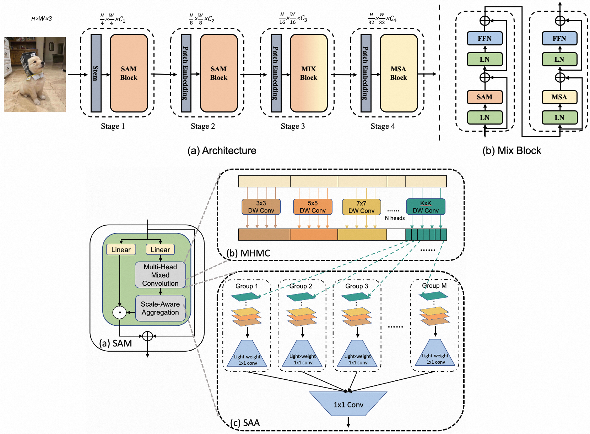

# Scale-Aware Modulation Meet Transformer

This repo is the official implementation of ["Scale-Aware Modulation Meet Transformer"](https://arxiv.org/pdf/2103.14030.pdf) as well as the follow-ups. It currently includes code and models for the following tasks:

> **Image Classification**

> **Object Detection and Instance Segmentation**

> **Semantic Segmentation**


## Introduction

**SMT** is initially described in [arxiv](https://arxiv.org/abs/2103.14030), which capably serves as a promising new generic backbone for efficient visual modeling.
SMT is a new hybrid ConvNet and vision Transformer backbone, which can effectively simulate the transition from local to global dependencies as the network goes deeper, resulting in superior performance over both ConvNets and Transformers.



## Main Results on ImageNet with Pretrained Models

**ImageNet-1K and ImageNet-22K Pretrained SMT Models**

| name | pretrain | resolution |acc@1 | acc@5 | #params | FLOPs | 22K model | 1K model |
| :---: | :---: | :---: | :---: | :---: | :---: | :---: |:---: |:---: |
| SMT-T | ImageNet-1K | 224x224 | 82.2 | 96.0 | 12M | 2.4G | - | [github](https://github.com/SwinTransformer/storage/releases/download/v1.0.0/swin_tiny_patch4_window7_224.pth)/[baidu](https://pan.baidu.com/s/156nWJy4Q28rDlrX-rRbI3w)/[config](configs/swin/swin_tiny_patch4_window7_224.yaml)/[log](https://github.com/SwinTransformer/storage/files/7745562/log_swin_tiny_patch4_window7_224.txt) |
| SMT-S | ImageNet-1K | 224x224 | 83.7 | 96.5 | 21M | 4.7G | - | [github](https://github.com/SwinTransformer/storage/releases/download/v1.0.0/swin_small_patch4_window7_224.pth)/[baidu](https://pan.baidu.com/s/1KFjpj3Efey3LmtE1QqPeQg)/[config](configs/swin/swin_small_patch4_window7_224.yaml)/[log](https://github.com/SwinTransformer/storage/files/7745563/log_swin_small_patch4_window7_224.txt) |
| SMT-B | ImageNet-1K | 224x224 | 84.3 | 96.9 | 32M | 7.7G | - | [github](https://github.com/SwinTransformer/storage/releases/download/v1.0.0/swin_base_patch4_window7_224.pth)/[baidu](https://pan.baidu.com/s/16bqCTEc70nC_isSsgBSaqQ)/[config](configs/swin/swin_base_patch4_window7_224.yaml)/[log](https://github.com/SwinTransformer/storage/files/7745564/log_swin_base_patch4_window7_224.txt) |
| SMT-L | ImageNet-22K | 224x224 | 87.1 | 98.1 | 81M | 17.6G | [github](https://github.com/SwinTransformer/storage/releases/download/v1.0.0/swin_base_patch4_window7_224_22k.pth)/[baidu](https://pan.baidu.com/s/1y1Ec3UlrKSI8IMtEs-oBXA)/[config](configs/swin/swin_base_patch4_window7_224_22k.yaml) | [github](https://github.com/SwinTransformer/storage/releases/download/v1.0.0/swin_base_patch4_window7_224_22kto1k.pth)/[baidu](https://pan.baidu.com/s/1n_wNkcbRxVXit8r_KrfAVg)/[config](configs/swin/swin_base_patch4_window7_224_22kto1k_finetune.yaml) |
| SMT-L | ImageNet-22K | 384x384 | 88.1 | 98.4 | 81M | 51.6G | [github](https://github.com/SwinTransformer/storage/releases/download/v1.0.0/swin_base_patch4_window12_384_22k.pth)/[baidu](https://pan.baidu.com/s/1vwJxnJcVqcLZAw9HaqiR6g) | [github](https://github.com/SwinTransformer/storage/releases/download/v1.0.0/swin_base_patch4_window12_384_22kto1k.pth)/[baidu](https://pan.baidu.com/s/1caKTSdoLJYoi4WBcnmWuWg)/[config](configs/swin/swin_base_patch4_window12_384_22kto1k_finetune.yaml) |


## Main Results on Downstream Tasks

**COCO Object Detection (2017 val)**

| Backbone | Method | pretrain | Lr Schd | box mAP | mask mAP | #params | FLOPs |
| :---: | :---: | :---: | :---: | :---: | :---: | :---: | :---: |
| SMT-S | Mask R-CNN | ImageNet-1K | 3x | 49.0 | 43.4 | 40M | 265G |
| SMT-B | Mask R-CNN | ImageNet-1K | 3x | 49.8 | 44.0 | 52M | 328G |
| SMT-S | Cascade Mask R-CNN | ImageNet-1K |  3x | 51.9 | 44.7 | 78M | 744G |
| SMT-S | RetinaNet | ImageNet-1K |  3x | 47.3 | - | 30M | 247G |
| SMT-S | Sparse R-CNN | ImageNet-1K |  3x | 50.2 | - | 102M | 171G |
| SMT-S | ATSS | ImageNet-1K |  3x | 49.9 | - | 28M | 214G |
| SMT-S | DINO | ImageNet-1K |  4scale | 54.0 | - | 40M | 309G |


**ADE20K Semantic Segmentation (val)**

| Backbone | Method | pretrain | Crop Size | Lr Schd | mIoU (ss) | mIoU (ms) | #params | FLOPs |
| :---: | :---: | :---: | :---: | :---: | :---: | :---: | :---: | :---: |
| SMT-S | UperNet | ImageNet-1K | 512x512 | 160K | 49.2 | 50.2 | 50M | 935G |
| SMT-B | UperNet | ImageNet-1K | 512x512 | 160K | 49.6 | 50.6 | 62M | 1004G |


## Getting Started

- Clone this repo:

```bash
git clone https://github.com/Afeng-x/SMT.git
cd SMT
```

- Create a conda virtual environment and activate it:

```bash
conda create -n smt python=3.8 -y
conda activate smt
```

Install `PyTorch>=1.10.0` with `CUDA>=10.2`:

```bash
pip3 install torch==1.10 torchvision torchaudio --index-url https://download.pytorch.org/whl/cu113
```

- Install `timm==0.4.12`:

```bash
pip install timm==0.4.12
```

- Install other requirements:

```bash
pip install opencv-python==4.4.0.46 termcolor==1.1.0 yacs==0.1.8 pyyaml scipy ptflops thop
```

### Evaluation

To evaluate a pre-trained `SMT` on ImageNet val, run:

```bash
python -m torch.distributed.launch --nproc_per_node 1 --master_port 12345 main.py --eval \
--cfg configs/smt/smt_base_224.yaml --resume /path/to/ckpt.pth \
--data-path /path/to/imagenet-1k
```

### Training from scratch on ImageNet-1K

To train a `Swin Transformer` on ImageNet from scratch, run:

```bash
python -m torch.distributed.launch --master_port 4444 --nproc_per_node 8 main.py \
--cfg configs/smt/smt_tiny_224.yaml \
--data-path /path/to/imagenet-1k --batch-size 128
```

### Pre-training on ImageNet-22K

For example, to pre-train a `Swin-B` model on ImageNet-22K:

```bash
python -m torch.distributed.launch --nproc_per_node 8 --master_port 12345  main.py \
--cfg configs/smt/smt_large_224_22k.yaml --data-path /path/to/imagenet-22k \
--batch-size 128 --accumulation-steps 4 
```

### Fine-tuning

```bashs
python -m torch.distributed.launch --nproc_per_node 8 --master_port 12345  main.py \
--cfg configs/smt/smt_large_384_22kto1k_finetune.yaml \
--pretrained /path/to/pretrain_ckpt.pth --data-path /path/to/imagenet-1k \
--batch-size 64 [--use-checkpoint]
```

### Throughput

To measure the throughput, run:

```bash
python -m torch.distributed.launch --nproc_per_node 1 --master_port 12345  main.py \
--cfg <config-file> --data-path <imagenet-path> --batch-size 64 --throughput --disable_amp
```

## Citing SMT

```
@inproceedings{liu2021Swin,
  title={Swin Transformer: Hierarchical Vision Transformer using Shifted Windows},
  author={Liu, Ze and Lin, Yutong and Cao, Yue and Hu, Han and Wei, Yixuan and Zhang, Zheng and Lin, Stephen and Guo, Baining},
  booktitle={Proceedings of the IEEE/CVF International Conference on Computer Vision (ICCV)},
  year={2021}
}
```

### Acknowledgement
This repository is built on top of the [timm](https://github.com/rwightman/pytorch-image-models) library and the official [Swin Transformer](https://github.com/microsoft/Swin-Transformer) repository.
